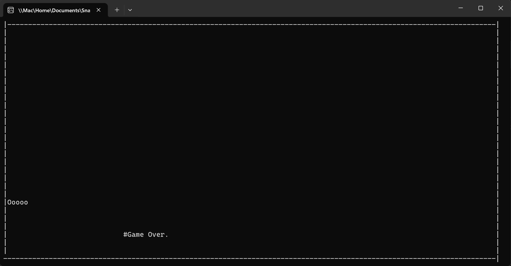

# Snake Game

> This project was developed for Programming 1 course at John Abbott College.

Go to demo: [Game Demo](#game-demonstration) (click here)

**Objective:** Guide the snake to eat 9 fruits, grow, and avoid collisions with walls.

**Controls:** Use arrow keys (up, down, left, right) to navigate the snake.

### Game Elements

- **Snake:** Displayed as "O" (head) and "o" (body).
- **Walls:** Form boundaries to prevent snake movement outside.
- **Fruits:** "#" symbols appearing randomly on the screen.

### Gameplay

1. **Main Menu:** Displays instructions and prompts the player to start when ready.
2. **Snake Movement:** Controlled by arrow keys, continuously updating in a separate thread (`GetInputSnake` method).
3. **Walls:** Boundaries are built around the console screen.
4. **Food Generation:** Randomly placed on the screen, represented by "#" (triggered by `AddFood` method).

### Collision Detection

- **Wall Collision:** Game over if the snake hits any wall.
- **Fruit Consumption:** Snake grows when it consumes a fruit, adding a segment to its body.
- **Win Condition:** Achieved when the snake's length surpasses 9 fruits.

### Outcome

- Display "Game Over" if the snake collides with a wall.
- Display victory message and total fruits consumed if the snake wins.

### Speed

- Adjustable speed (`Thread.Sleep`) for adapting to different console sizes.

### Console Interaction

- Hides the cursor for a cleaner interface.

### Main Method Flow

1. Display Main Menu.
2. Initialize snake and food.
3. Run input and food generation in separate threads.
4. Continuously update and display game elements.
5. Check for collisions and victory conditions.
6. Display appropriate messages on game outcome.

### Note

- Modify speed for different console sizes for optimal gameplay.

### Game Demonstration
>The instructions of the game is shown to the user.

>Snake grows when it consumes a fruit, adding a segment to its body.

>Display "Game Over" if the snake collides with a wall.

